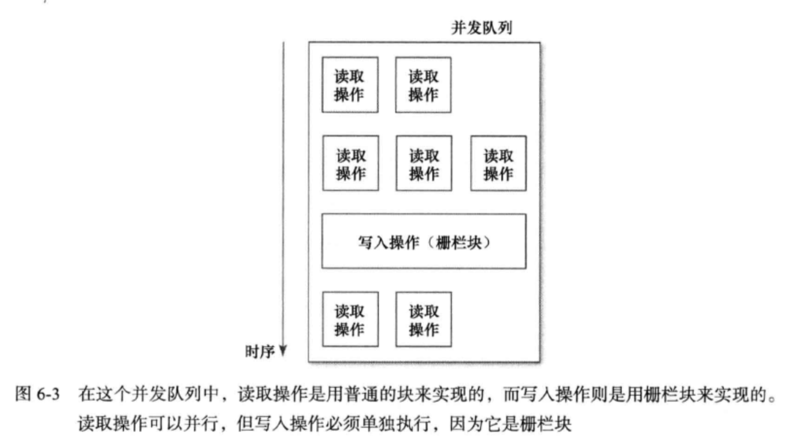

# Objective-C Notes
教程合集
* [The basics of Objective-C tutorial series by raywenderlich.com](https://www.youtube.com/playlist?list=PL23Revp-82LLqM6azUAr9at03whFNL9Ld)
* [learnxinyminutes.com](https://learnxinyminutes.com/docs/objective-c/)
## [Property Attributes](https://stackoverflow.com/questions/8927727/objective-c-arc-strong-vs-retain-and-weak-vs-assign)
**原子性**

* `atomic(默认)`系统生成的getter/setter方法会进行加锁操作。它保证当对一个属性进行多线程多进程的读和写操作时，也可以返回一个确定的值，但是并不确定是修改之前或之后的值。但并<b>不要误认为它是线程安全的</b>，
  当几个线程同时调用同一属性的setter、getter方法时,会get到一个完整的值,但get到的值不可控.

  例如:线程1调用getter，线程2 调用setter，线程3 调用setter。这3个线程并行同时开始,线程1会get到一个值,但是这个值不可控,可能是线程2,线程3 set之前的原始值,可能是线程2 set的值,也可能是线程3 set的值

* `non-atomic` 系统生成的getter/setter方法没有加锁 线程不安全。当你读取它的值时，如果它正在被写入修改，那你会得到一个垃圾信息。但是它的速度比atomic更快。当你经常对一个属性进行访问时，使用nonatomic会可以保证你的性能。当你只在一个线程中读取和修改属性时，也采用它，比如在主线程中访问UI属性。

**修改权限**

* `readwrite(默认)`
* `readonly`没有setter的实现。⚠️如果在.m文件的interface中声明一个属性为`readonly`，则在.m中的implement中不可读取，如果在.h文件的`interface`中申明为`readonly`,但是在.m中的interface（“class-continuation分类”）中重写为`readwrite`，则在impement中也可以修改。

**强指引**

* `strong(默认)`为该Object的属性设置新值时，设置方法会先retain保留新值，并release释放旧值，然后把新值设置上。当此Object变为nil，且无其他Object strong指引此属性时，此属性会被deallocated and released。同理，当所有的strong指引于此Object都变成nil时，该Object将被deallocated.
* `copy` 与`strong`类似，但是设置方法并不保留新值，而是将其copy来。常用与像NSString这样自身不可变，但含有可变子类的Object上，来保护其封装性。因为传递给设置方法的新值可能是一个NSMutableString类的实例，此时若是不拷贝字符串，那么该属性可能会在不知情情况下执行可变方法导致更改，所以此时就要拷贝一份不可变的字符串，确保该属性不会被无意间变动。
* `retain`==`strong`。`strong`用于最新的ARC模式下，而`retain`是MRC方式下的方法。

blocks为什么要是用copy(weakSelf should be used instead of self to avoid memory cycles) ?

苹果文档说：“Note: You should specify copy as the property attribute, because a block needs to be copied to keep track of its captured state outside of the original scope. This isn’t something you need to worry about when using Automatic Reference Counting, as it will happen automatically, but it’s best practice for the property attribute to show the resultant behavior. For more information, see Blocks Programming Topics.”

解释：“block默认是创建在栈上，意味着它们只存在于它们被创建的空间里。为了以后你可以在其他地方使用它，它们必须被拷贝到堆上。在ARC中，当block在创建空间的其他地方被使用时，会被自动拷贝。实际中我们习惯显性写出copy”

**弱指引**

* `weak`为该属性设置新值时，既不保留新值，也不释放旧值。该属性是不是nil，该Object都可以释放。常用于delegates，同`assign`类似。
* `unsafe_unretained`类似`weak`用于属性（Object）类型
* `assign(默认)`效果与弱指引类似，主要用于纯量类型（scalar type）比如int CGFloat NSInteger；也可以用于Object类型

**区别在于** 当目标对象被摧毁后，`weak`属性会指向nil，而`unsafe_unretained`和`assign`属性值不会被清空，依然指向被摧毁的目标属性，造成野指针，所以说是不安全的。

## Blocks
使用方法[fuckingblocksyntax.com](http://fuckingblocksyntax.com/)

#### block属性能不能用strong修饰

首先，在以下情形中block会自动从栈拷贝到堆：

1. 当 block 调用 copy 方法时，如果 block 在栈上，会被拷贝到堆上；
2. 当 block 作为函数返回值时，编译器自动将 block 作为 _Block_copy 函数，效果等同于直接调用 copy 方法；
3. **当 block 被赋值给 __strong id 类型的对象或 block 的成员变量时**，编译器自动将 block 作为 _Block_copy 函数，效果等同于直接调用 copy 方法；
4. 当 block 作为参数被传入方法名带有usingBlock 的 Cocoa Framework 方法或 GCD 的 API 时。这些方法会在内部对传递进来的 block 调用 copy 或 _Block_copy 进行拷贝;

所以可以理解为ARC下strong修饰的block并没有处于栈区的可能，也就不存在作用域结束栈区内容销毁野指针的问题了。 但是为了保证修饰符和block特性的一致性，使用copy修饰符仍然是最为合适的。

#### __block 关键字的底层实现原理

**block不允许修改外部变量的值**（这里所说的外部变量的值，指的是栈中 auto 变量）。但block可以读取外部变量的值，比如`NSMutableArray`。不可以直接赋值，但是可以执行他的` addObject`方法。

`__block` 作用是将 auto 变量封装为结构体(对象)，在结构体内部新建一个同名 auto 变量，block 内截获该结构体的指针，在 block 中使用自动变量时，使用指针指向的结构体中的自动变量。于是就可以达到修改外部变量的作用。

如果要修改，需要满足以下两个条件：

1. **将 auto(无修饰符修饰)变量从栈 copy 到堆**，原因是：栈中内存管理是由系统管理，出了作用域就会被回收，堆中才是可以由我们程序员管理。**在ARC中无论是否添加 `__block` ，block 中的auto变量都会被从栈上 copy 到堆上。**
2. **将 auto 变量封装为结构体(对象)**。

## KVC & KVO
[From Objccn.io](https://objccn.io/issue-7-3/)

[facebook/KVOController](https://github.com/facebook/KVOController)

### KVO 总结

KVO是一个对象能观察另一个对象属性的值，KVO适合任何对象监听另一个对象的改变，这是一个对象与另外一个对象保持同步的一种方法。KVO 只能对属性做出反应，不会用来对方法或者动作做出反应。

#### 原理

当某个类的对象第一次被观察时，系统就会在运行期动态地创建该类的一个派生类，在这个派生类中重写基类中任何被观察属性的 setter 方法，

派生类在被重写的 setter 方法实现真正的通知机制。

同时派生类还重写了 class 方法以“欺骗”外部调用者它就是起初的那个类。然后系统将这个对象的 isa 指针指向这个新诞生的派生类，因此这个对象就成为该派生类的对象了，因而在该对象上对 setter 的调用就会调用重写的 setter，从而激活键值通知机制。此外，派生类还重写了 dealloc 方法来释放资源。

```objective-c
- (void)setName:(NSString *)newName
{
    [self willChangeValueForKey:@"name"];    // KVO在调用存取方法之前总调用
    [super setValue:newName forKey:@"name"]; // 调用父类的存取方法
    [self didChangeValueForKey:@"name"];     // KVO在调用存取方法之后总调用
}
```

**优点：**

1. 提供一个简单的方法来实现两个对象的同步。
2. 能够提供观察的属性的新值和旧值。
3. 每一次属性值改变都是自动发送通知，不需要开发者手动实现。
4. 用keypath来观察属性，因此也可以观察嵌套对象。

**缺点：**

1. 观察的属性必须使用字符串来定义，因此编译器不会出现警告和检查。
2. 代码冗长，当观察多个对象的属性时就要写"if"语句，来判断当前的回调属于哪个对象的属性的回调。
3. 推出时需要remove观察者

#### 问题：KVO怎么实现，_语法会不会触发，成员变量会不会触发，KVC+成员变量会不会触发，不用setter怎么触发KVO

##### 实现原理

- KVO是通过isa-swizzling技术实现的(这句话是整个KVO实现的重点)。
- 在运行时根据原类创建一个中间类，这个中间类是原类的子类，并动态修改当前对象的isa指向中间类。当修改 instance 对象的属性时，会调用 Foundation框架的 _NSSetXXXValueAndNotify 函数 ,该函数里面会先调用 willChangeValueForKey: 然后调用父类原来的 setter 方法修改值，最后是 didChangeValueForKey:。didChangeValueForKey 内部会触发监听器（Oberser）的监听方法observeValueForKeyPath:ofObject:change:context:
- 并且将class方法重写，返回原类的Class。

```objective-c
#import "ViewController.h"

@interface ViewController () {
  // 成员变量
    NSString* job;
}
// 属性变量
@property (nonatomic, copy) NSString* name;
@end

@implementation ViewController
- (void)viewDidLoad {
    [super viewDidLoad];
    self.name = @"1";
    [self addObserver:self forKeyPath:@"name" options:(NSKeyValueObservingOptionOld | NSKeyValueObservingOptionNew) context:nil];
    self.name = @"2";
//    _语法不会触发，因为不会调用set方法
    _name = @"3";
    NSLog(@"name = %@", _name);
    
    job = @"a";
    [self addObserver:self forKeyPath:@"job" options:(NSKeyValueObservingOptionOld | NSKeyValueObservingOptionNew) context:nil];
//    成员变量不会触发，因为不会调用set方法
    job = @"b";
//    成员变量会触发，因为注册了observer就会有set方法，使用KVC就会调用set方法
    [self setValue:@"c" forKey:@"job"];
// 		也可以手动触发KVO
    [self willChangeValueForKey:@"job"];
    job = @"d";
    [self didChangeValueForKey:@"job"];
    NSLog(@"job = %@", job);
}

- (void)observeValueForKeyPath:(NSString *)keyPath ofObject:(id)object change:(NSDictionary *)change context:(void *)context
{
    if ([keyPath isEqualToString:@"name"]) {
        NSLog(@"change = %@", change);
    }
    else if ([keyPath isEqualToString:@"job"]) {
        NSLog(@"change = %@", change);
    }
    else {
        [super observeValueForKeyPath:keyPath ofObject:object change:change context:context];
    }
}
- (void)dealloc
{
    [self removeObserver:self forKeyPath:@"name"];
    [self removeObserver:self forKeyPath:@"job"];
}
@end
```

```objective-c
被打印的结果
change = {
    kind = 1;
    new = 2;
    old = 1;
}
name = 3
change = {
    kind = 1;
    new = c;
    old = b;
}
change = {
    kind = 1;
    new = d;
    old = c;
}
job = d
```


### KVC 总结

键值编码是一种间接访问对象的属性使用字符串来标识属性，而不是通过调用存取方法直接或通过实例变量访问的机制，非对象类型的变量将被自动封装或者解封成对象，很多情况下会简化程序代码。

**优点：**

1. 不需要通过 setter、getter 方法去访问对象的属性，可以访问对象的私有属性。
2. 可以轻松处理集合类(NSArray)。

**缺点：**

1. 一旦使用 KVC 你的编译器无法检查出错误，即不会对设置的键、键值路径进行错误检查。
2. 执行效率要低于setter和getter方法。因为使用 KVC 键值编码，它必须先解析字符串，然后在设置或者访问对象的实例变量。
3. 使用 KVC 会破坏类的封装性。

## weakSelf & strongSelf
[深入研究 Block 用 weakSelf、strongSelf、@weakify、@strongify 解决循环引用](https://halfrost.com/ios_block_retain_circle/)

[stackoverflow self & block](https://stackoverflow.com/questions/20030873/always-pass-weak-reference-of-self-into-block-in-arc)

[Raywenderlich Instruments-tutorial](https://www.raywenderlich.com/397-instruments-tutorial-with-swift-getting-started)

示例

`Model.h`

```objective-c
#import <Foundation/Foundation.h>

NS_ASSUME_NONNULL_BEGIN

typedef void(^Study)(void);
@interface Student : NSObject
@property (nonatomic, copy) NSString* name;
@property (nonatomic, copy) Study study;
@end

@interface Teacher : NSObject
@property (copy , nonatomic) NSString *name;
@property (strong, nonatomic) Student *student;
@end
NS_ASSUME_NONNULL_END
```
`Model.m`
```objective-c
#import "Model.h"
@implementation Student
@end
@implementation Teacher
@end
```
`ViewController.m`
```swift
- (void)viewDidLoad {
    [super viewDidLoad];
    
    Student *student = [[Student alloc]init];
    Teacher *teacher = [[Teacher alloc]init];
    
    teacher.name = @"i'm teacher";
    teacher.student = student;
    
    student.name = @"halfrost";
    student.study = ^{
        NSLog(@"my name is = %@",strongTeacher.name);
    };
    student.study();
}
@end
```
👆此处出现了异常。teacher持有student，student持有study block，block持有student，三方相互持有造成异常

修改如下：

```objective-c
    __weak __typeof(teacher) weakTeacher = teacher;
    student.study = ^{
        NSLog(@"my name is = %@",weakTeacher.name);
    };
```
但在study block运行时并不能保证每次teacher都不为空，所以需要修改为以下：
```objective-c
    __weak __typeof(teacher) weakTeacher = teacher;
    student.study = ^{
        __strong __typeof(weakTeacher) strongTeacher = weakTeacher;
        if (strongTeacher) {
            NSLog(@"my name is = %@",strongTeacher.name);
        }
    };
    teacher = nil;//假设在执行block前出现意外
    student.study();
```
strongSelf的目的是因为一旦进入block执行，不允许self在这个执行过程中释放。block执行完后这个strongSelf 会自动释放，不会存在循环引用问题。但是依然需要判断strongSelf是否为空，因为strongSelf只能保证在函数内即block内不为空，不能保证外部情况。

# Effective Objective-C 读书笔记
## 第2条：在类的头文件中尽量少引入其他头文件
应该在.h文件中尽量使用`@class XXX;`引入类，在.m文件中需要用到时，再使用`#import "XXX".h` 引入头文件,原因：
1. 使用`#import`会引入该类中的所有内容，增加编译时间
2. 两个类头文件中都使用`#import`引入对方类头文件，会导致其中一个类无法编译
## 第4条：多用类型常量，少用#define预处理指令
使用#define时如果有人重新定义了常量值，编译器不会发出警告，从而导致应用程序中的常量值不一致.

局部变量,在.m文件中的使用static const来定义，例如：

 ```objective-c
static const NSString* TestString = @"TestString";
 ```
全局变量，需要.h文件中使用extern来声明，并在.m文件中实现，通常其名称需要加以隔离，通常用类名做前缀。例如：
```objective-c
// Person.h
extern const NSString* PersonNameChangedNotification;
// Person.m
const NSString* PersonNameChangedNotification = @"PersonNameChangedNotification";
```
## 第11条: 理解objc_msgSend的作用（消息传递机制）
在Objectve-C中，如果向某对象传递消息，那就会使用动态绑定机制来决定需要调用的方法。在底层，所有的方法都是普通的C语言函数，然后对象接收到消息之后，究竟调用哪个方法则完全于运行期决定，甚至可以在运行进行时改变，这些特性是的Objective-C成为一门真正的动态语言。给对象发送信息可以这样写：
```objective-c
id returnValue = [someObject messageName:parameter];
```
本例中，someObject叫做“接收者”，messageName叫做“选择子”。选择子与参数合起来叫“消息”。编译器看到此消息后，将其转换成一条标准的C语言函数调用，该很熟乃是消息传递机制中的核心函数，叫做objc_msgSend，其“原型”如下：
```objective-c
void objc_msgSeng(id self, SEL cmd, ...)
```
第一个参数表示接受者，第二个参数表示选择子，后续参数就是消息中的那些参数，其顺序不变。选择子指的是方法的名字。编译器会把刚才例子中的方法转换为如下的函数:
```objective-c
id returnValue = objc_msgSend(someObject, @selector(messageName:), parameter);
```
**该方法需要在接收者所属的类中搜寻其“方法列表”，如果能找到与其选择子名称相符的方法，就跳至其实现代码，若找不到，就沿着继承体系继续向上查找，等找到合适的方法之后再跳转。如果最终还是找不到相符的方法，那就执行“消息转发”操作。**

## 第12条: 理解消息转发机制
Step1: 动态方法解析（给个机会让类添加这个来实现这个函数）

e.g.

```objective-c
// 或者resolveClassMethod
+ (BOOL)resolveInstanceMethod:(SEL)sel {
  
  class_addMethod([self class],
                  sel,
                  imp_implementationWithBlock(^(id self) {
	    NSLog(@"resolveInstanceMethod : %@", NSStringFromSelector(sel));
  }),
                  "v@*");

  return YES;
}
```


Step2: 备援接收者（快速转发，让别的对象去执行这个函数）

e.g.

```objective-c
- (id)forwardingTargetForSelector:(SEL)aSelector {
    return AReceiverObject.new;
}
```

Step3: 完整的消息转发（标准转发，灵活的将目标函数以其他形式执行）

```objective-c
+ (void)forwardInvocation:(NSInvocation*)invocation
```

#### 在crash之前，阻止预防

在经过上述的消息传递和转发后，如果都不中，调用doesNotRecognizeSelector抛出异常。

[修改三种方法的实现](https://blog.csdn.net/qian521kun521/article/details/90412263)

我们选择第二个forwardingTargetForSelector来做处理。原因如下：

1. resolveInstanceMethod 需要在类的本身上动态添加它本身不存在的方法，这些方法对于该类本身来说冗余的
2. forwardInvocation可以通过NSInvocation的形式将消息转发给多个对象，但是其开销较大，需要创建新的NSInvocation对象，并且forwardInvocation的函数经常被使用者调用，来做多层消息转发选择机制，不适合多次重写
3. forwardingTargetForSelector可以将消息转发给一个对象，开销较小，并且被重写的概率较低，适合重写

选择了forwardingTargetForSelector之后，可以将NSObject的该方法重写，做以下几步的处理：

1. 动态创建一个自定义类

2. 动态为自定义类添加对应的Selector，用一个通用的返回0的函数来实现该SEL的IMP

3. 将消息直接转发到这个自定义类对象上。

## 第13条: 方法调配技术Method Swizzling
一般来说，只在调试程序时候才需要在运行期修改方法实现，不宜滥用，用多了不宜读懂且难以维护

**Swizzling 方法替换在Objcetive-C和Swift5中的实现**

```swift
// Swift5
import UIKit
import Foundation
// 继承自NSObject
class Car: NSObject{
    let name: String
    init(name: String) {
        self.name = name
    }
    // 表明 dynamic
    @objc dynamic func run(){
        print(name + " running")
    }
    @objc func walk(){
        print(name + " walk")
    }
}

let mustang = Car.init(name: "Mustang")
mustang.run()
let m1 = class_getInstanceMethod(Car.self, #selector(mustang.run))
let m2 = class_getInstanceMethod(Car.self, #selector(mustang.walk))
if let m1 = m1, let m2 = m2{
    method_exchangeImplementations(m1, m2)
    mustang.run()
}else{
    print("error")
}

```
```swift
// Objcetive-C
Method originalTurnOn = class_getInstanceMethod(mustang.class, @selector(turnOn));
IMP newIMP =  class_getMethodImplementation(mustang.class, @selector(accelerate));
method_setImplementation(originalTurnOn, newIMP);//method_getImplementation(newTurnOn));
[mustang turnOn];
```

## 第41条: 多用派发队列，少用同步锁

如果要多个线程执行同一份代码，有时会出问题，通常情况下要用锁来实现某种同步机制。

**方法一：同步块 synchronization block**

```objective-c
- (void)synchronizedMethod{
  @synchronized(self) {
    // Safe code
  }
}
```

它可以保证每个对象实例都不受干扰的运行synchronizedMethod，然而如果滥用@synchronized(self) 则**会降低代码效率，因为共用用一个锁的那些同步块，都必须按照顺序执行。若是在self对象上频繁加锁，那么程序可能要等另一段与此无关的代码执行完，才能继续执行当前代码。**

属性就是做成**原子的atomic**修饰就可以做到,但是不能说是线程安全的。

**方法二： NSLock对象**

```objective-c
_lock = [[NSLock alloc] init];
- (void)synchronizedMethod{
	[_lock lock];
	// Safe code
  [_lock unlock];
  }
}
```

**缺陷：**极端情况下会导致死锁，另外效率也不高。

**方法三：使用GCD “串行同步队列”**

set方法和get方法都安排在序列化的队列中执行，即可保证数据同步。

```objective-c
_syncQueue = dispatch_queue_create("com.xxx.syncqueue", NULL);
- (NSString*)someString{
  	__block NSString* localSomeString;
  	dispatch_sync(_syncQueue, ^{
				localSomeString = _someString;
  	});
    return localSomeString;
}
- (void)setSomeString:(NSString*)someString{
  	dispatch_sync(_syncQueue, ^{
      	_someString = someString;
    });
}
```

**进一步优化：把set方法同步派发改为异步派发**。

set方法并不一定非要是同步的。因为set方法并不用返回值，所以set方法可以改成如下：

```objective-c
- (void)setSomeString:(NSString*)someString{
  	dispatch_async(_syncQueue, ^{
      	_someString = someString;
    });
}
```

**弊端**：因为执行异步派发时需要拷贝块，如果拷贝块所用的时间超过执行块所用的时间，则会比原来更慢。

**方法四：并发队列** 

并行执行多个get方法，而get方法和set方法之间不能并发执行。

```objective-c
_syncQueue = dispatch_get_global_queue(DISPATCH_QUEUE_PRIORITY_DEFAULT, 0);
- (NSString*)someString{
  	__block NSString* localSomeString;
  	dispatch_sync(_syncQueue, ^{
				localSomeString = _someString;
  	});
    return localSomeString;
}
- (void)setSomeString:(NSString*)someString{
  	dispatch_sync(_syncQueue, ^{
      	_someString = someString;
    });
}
```

使用栅栏barrier让set方法单独执行

```objective-c
- (void)setSomeString:(NSString*)someString{
  	dispatch_barrier_async(_syncQueue, ^{
      	_someString = someString;
    });
}
```



