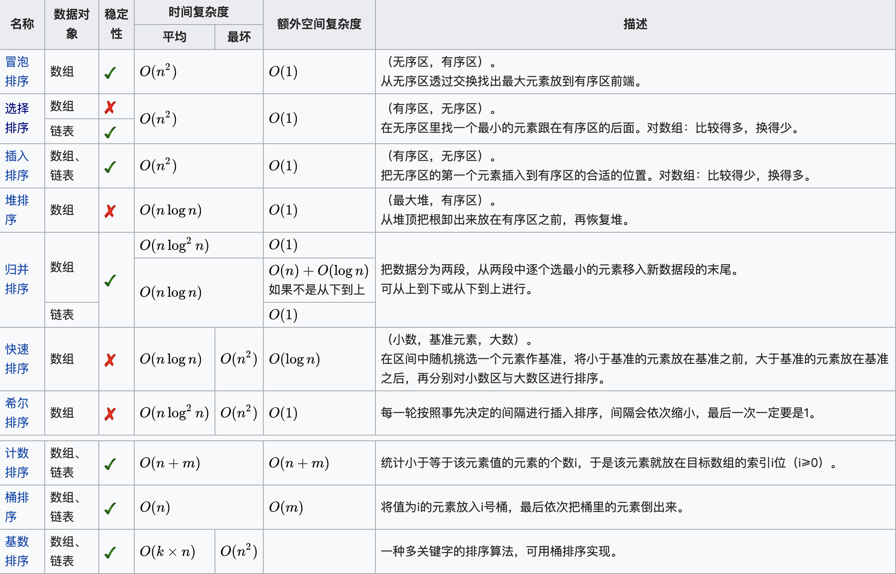

### [1. 两数之和](https://leetcode-cn.com/problems/two-sum)
#### 重点
使用字典来提升时间效率
#### 题目描述
给定一个整数数组 nums 和一个目标值 target，请你在该数组中找出和为目标值的那 两个 整数，并返回他们的数组下标。
你可以假设每种输入只会对应一个答案。但是，你不能重复利用这个数组中同样的元素。

示例:
给定 nums = [2, 7, 11, 15], target = 9
因为 nums[0] + nums[1] = 2 + 7 = 9
所以返回 [0, 1]
#### 答案
```swift
func twoSum(_ nums: [Int], _ target: Int) -> [Int] {
    var mIndex = 0;
    var dic: [Int:Int] = [:]
    for m in nums{
        let value: Int? = dic[target-m]
        if value != nil && value! != mIndex{
            return [value!, mIndex]
        }
        dic[m] = mIndex;
        mIndex += 1
    }
    return [];
}
```

### [7. 整数反转](https://leetcode-cn.com/problems/reverse-integer)
#### 重点
假设我们的环境只能存储得下 32 位的有符号整数，则其数值范围为 [−2^31,  2^31 − 1]。请根据这个假设，如果反转后整数溢出那么就返回 0。
#### 题目描述
给出一个 32 位的有符号整数，你需要将这个整数中每位上的数字进行反转。
示例 1:
输入: 123
输出: 321
示例 2:
输入: -123
输出: -321
示例 3:
输入: 120
输出: 21
#### 答案
```swift
func reverse(_ x: Int) -> Int {
    var x = x
    var result: Int = 0
    while x != 0 {
        let m = x % 10
        x = (x - m) / 10
        if (result > Int32.max/10 || (result == Int32.max/10 && m >  Int32.max%10)) {
            return 0
        }
        if (result < Int32.min/10 || (result == Int32.min/10 && m <  Int32.min%10)) {
            return 0
        }
        result = result*10 + m
    }
    return result
}
```
### [70. 爬楼梯](https://leetcode-cn.com/problems/climbing-stairs/)
#### 重点
动态规划
#### 题目描述
假设你正在爬楼梯。需要 n 阶你才能到达楼顶。
每次你可以爬 1 或 2 个台阶。你有多少种不同的方法可以爬到楼顶呢？
注意：给定 n 是一个正整数。

示例 1：
输入： 2
输出： 2
解释： 有两种方法可以爬到楼顶。
1.  1 阶 + 1 阶
2.  2 阶
示例 2：

输入： 3
输出： 3
解释： 有三种方法可以爬到楼顶。
1.  1 阶 + 1 阶 + 1 阶
2.  1 阶 + 2 阶
3.  2 阶 + 1 阶
#### 答案
```swift
func climbStairs(_ n: Int) -> Int {
    if n<3 {
        return n
    }
    var array = Array.init(repeating: 0, count: n + 1)
    array[0] = 0
    array[1] = 1
    array[2] = 2
    if n > 2{
        for i in 3...n {
            array[i] = array[i - 1] + array[i - 2]
        }
    }
    return array[n]
}
```
### [912. 排序数组](https://leetcode-cn.com/problems/sort-an-array/)
#### 重点

几种常用排序方法

#### 题目描述

给你一个整数数组 nums，请你将该数组升序排列。

示例 1：

输入：nums = [5,2,3,1]
输出：[1,2,3,5]

示例 2：

输入：nums = [5,1,1,2,0,0]
输出：[0,0,1,1,2,5]

#### 答案

[面试中的 10 大排序算法总结](http://www.codeceo.com/article/10-sort-algorithm-interview.html)

[排序可视化](https://www.cs.usfca.edu/~galles/visualization/ComparisonSort.html)

##### 平衡指标
1. 计算的时间复杂度（最差、平均、和最好性能），依据列表（list）的大小n。一般而言，好的性能是O(nlog n)，坏的性能是 O(n^2)。对于一个排序理想的性能是O(n)，但平均而言不可能达到。
2. 内存使用量（以及其他电脑资源的使用）
3. 稳定性：稳定排序算法会让原本有相等键值的纪录维持相对次序。也就是如果一个排序算法是稳定的，当有两个相等键值的纪录R和S，且在原本的列表中R出现在S之前，在排序过的列表中R也将会是在S之前。



#### 快速排序 
双向冒泡+递归分治。快速排序是表现最好的排序算法,也是不稳定的，其时间平均时间复杂度是O(nlgn)。
1. 以第一个数为基准，从右往左找到比基准小的数，从左往往右找到比基准大的数，交换两个数，直至相遇
2. 将相遇的数与基准数交换位置
3. 分别递归相遇位置左边的数组，和右边的数组


```swift
func quickSortArray(_ nums: [Int]) -> [Int] {
    if nums.count < 2 { return nums }
    var nums = nums
    quickSort(&nums, 0, nums.count - 1)
    return nums
}
func quickSort(_ nums: inout [Int], _ left: Int, _ right: Int){
    if left >= right {
        return
    }
    let index = partition(&nums, left, right)
    quickSort(&nums, left, index - 1)
    quickSort(&nums, index + 1, right)
}
func partition(_ nums: inout [Int], _ left: Int, _ right: Int) -> Int {
    let standard = nums[left]
    var i = left, j = right
    while i != j {
        while j > i && nums[j] >= standard{
            j -= 1
        }
        nums[i] = nums[j]
        while j > i && nums[i] < standard{
            i += 1
        }
        nums[j] = nums[i]
    }
    nums[i] = standard
    return i
}
```

#### 归并排序
空间复杂度为O(n)，时间复杂度为O(nlogn)。
1. 依次向下递归，直到最后一层，数组里只有两个元素时，进行排序
2. 依次向上返回递归，将两个数组排序后合并为一个
3. 继续向上，直到结束
```swift
 func mergeSort(_ nums: [Int]) -> [Int] {
    if nums.count < 2 {
        return nums
    }
    if nums.count == 2 {
        return [min(nums[0], nums[1]),max(nums[0], nums[1])]
    }
    let index: Int = nums.count / 2
    let left = mergeSort(([Int])(nums[0..<index]))
    let right = mergeSort(([Int])(nums[index..<nums.count]))
    var i = 0, j = 0
    var result = [Int]()
    while i < left.count && j < right.count {
        if left[i] < right[j] {
            result.append(left[i])
            i += 1
        } else {
            result.append(right[j])
            j += 1
        }
    }
    if i == left.count{
        result += right[j..<right.count]
    } else {
        result += left[i..<left.count]
    }
    return result
}
func mergeSortArray(_ nums: [Int]) -> [Int] {
    return mergeSort(nums)
}
```

#### 希尔排序
希尔排序是插入排序的一种高效率的实现，简单的插入排序中，如果待排序列是正序时，时间复杂度是O(n)，如果序列是基本有序的，使用直接插入排序效率就非常高。希尔排序就利用了这个特点。希尔排序的复杂度分析是复杂的，时间复杂度是所取增量的函数，在大量实验表明时间复杂度最高可以达到O(n^1.3)。
1. 确定步长为数组数组长度一半。先将序列分割成为步长数量个子序列，分别进行直接插入排序
2. 步长缩小为一半，继续分别插入排序
3. 直到步长为1时，执行一次插入排序。

```swift
func shellSort(_ nums: inout [Int], _ distance: Int) {
    for i in 0..<distance {
        var j = i + distance
        while j < nums.count {
            var k = j
            while k > i {
                if nums[k] < nums[k-distance] {
                    let temp = nums[k]
                    nums[k] = nums[k-distance]
                    nums[k-distance] = temp
                    k -= distance
                } else {
                    break
                }
            }
            j += distance
        }
    }
}
func shellSortArray(_ nums: [Int]) -> [Int] {
    var nums = nums
    var distance: Int = nums.count / 2
    while distance >= 1 {
        print(distance, nums)
        shellSort(&nums, distance)
        distance = distance/2
    }
    return nums
}
```
#### 堆排序

主要思想步骤：

1. 将数组按堆结构，第一次逐个分布到堆数组中
2. 将堆数组的第一个数取出来（最大数）放到结果数组中，把堆最后一个元素放到第一个位置中，重新排序堆，将元素依次往下与较大的子元素交换位置
3. 重复第二步，直到堆剩下最后一个元素，加入到结果数组中，排序结束

```swift
// 父在数组中的位置是i 则左子元素位置是2i+1 则右子元素位置是2i+2
func heapSort(_ nums: [Int]) -> [Int] {
    if nums.count < 2 {
        return nums
    }
    var heap = createHeap(nums)
    var result = [Int]()
    while heap.count > 1 {
        result.insert(sortHeapOneTime(&heap), at: 0)
    }
    result.insert(heap.first!, at: 0)
    return result
}
func createHeap(_ nums: [Int]) -> [Int] {
    var result = Array.init(repeating: 0, count: nums.count)
    for i in 0..<nums.count {
        result[i] = nums[i]
        var currentIndex = i
	      // 依次将元素加入堆数组
        while currentIndex > 0 {
            let fatherIndex = (currentIndex - 1) / 2
          	// 如果元素比父元素大，则交换
            if result[currentIndex] > result[fatherIndex] {
                let temp = result[currentIndex]
                result[currentIndex] = result[fatherIndex]
                result[fatherIndex] = temp
                currentIndex = fatherIndex
            } else {
                break
            }
        }
    }
    return result
}
func sortHeapOneTime(_ heap: inout [Int]) -> Int {
    let top = heap.first!
    heap[0] = heap.removeLast()
    var current = 0
    while 2*current + 1 < heap.count {
        var maxChildIndex = 2 * current + 1
      	// 如果存在右子元素，则与左子元素比较大小，取大的
        if maxChildIndex + 1 < heap.count {
            if heap[maxChildIndex + 1] > heap[maxChildIndex] {
                maxChildIndex += 1
            }
        }
      	// 如果子元素大于自己，则交换位置
        if heap[maxChildIndex] > heap[current] {
            let temp = heap[current]
            heap[current] = heap[maxChildIndex]
            heap[maxChildIndex] = temp
            current = maxChildIndex
        } else {
            break;
        }
    }
    return top
}
```


#### 计数排序

计数排序时线性时间复杂度O(n)的排序算法，只不过有前提条件，就是待排序的数的最大值与最小值差要在一定范围内，而且计数排序需要比较多的辅助空间。
1. 遍历数组，获得最大值
2. 建立个长度为（最大值-最小值）的数组，元素初始值为0
3. 遍历数组，记录元素位置为index的出现次数
4. 遍历自己建立的大数组，依次添加 出现的次数个该元素，

```swift
func countSortArray(_ nums: [Int]) -> [Int] {
    var max = 0
    var min = 0
    for num in nums {
        if num > max {
            max = num
        }
        else if num < min {
            min = num
        }
    }
    var result = [Int]()
    if min >= 0 {
        var array = Array.init(repeating: 0, count: max+1)
        for num in nums {
            array[num] += 1
        }
        for i in 0..<array.count {
            if array[i] > 0 {
                result += Array.init(repeating: i, count: array[i])
            }
        }
    } else {
        var array = Array.init(repeating: 0, count: max - min + 1)
        for num in nums {
            array[num - min] += 1
        }
        for i in 0..<array.count {
            if array[i] > 0 {
                result += Array.init(repeating: i + min, count: array[i])
            }
        }
    }
    return result
}
```
#### 桶排序
桶排序算是计数排序的一种改进和推广。桶排序是稳定的。对于N个待排数据，M个桶，当N=M时，即极限情况下每个桶只有一个数据时。桶排序的最好效率能够达到O(N)。

总结： 桶排序的平均时间复杂度为线性的O(N+N*(logN-logM))。如果相对于同样的N，桶数量M越大，其效率越高，最好的时间复杂度达到O(N)。 当然桶排序的空间复杂度 为O(N+M)，如果输入数据非常庞大，而桶的数量也非常多，则空间代价无疑是昂贵的。此外，
1.  找到一个映射函数f(n), 将原数组中N元素，按照f(n)分到M个桶里， 例如：f(n) = n/10 分到10个桶里
2. 将每个桶里的元素进行排序，例如使用快速排序
3. 从小桶到大桶，依次添加到结果数组。

#### 基数排序
基数排序是一种借助多关键字排序思想对单逻辑关键字进行排序的方法。所谓的多关键字排序就是有多个优先级不同的关键字。对数字进行排序，那么个位、十位、百位就是不同优先级的关键字，如果要进行升序排序，那么个位、十位、百位优先级一次增加。基数排序是通过多次的收分配和收集来实现的，关键字优先级低的先进行分配和收集。
1. 按个位的数字，依次分配到0-9的十个数组中，重新组装数组

2. 按十位的数字...

3. 一直到最高位... 后得到结果

```swift
func radixSort(_ nums: [Int]) -> [Int] {
    var negativeArray = [Int]()
    var positiveArray = [Int]()
    for num in nums {
        if num < 0 {
            negativeArray.append(num * -1)
        } else {
            positiveArray.append(num)
        }
    }
    var result = [Int]()
    for num in radixSortArray(negativeArray) {
        result.insert(num * -1, at: 0)
    }
    return result + radixSortArray(positiveArray)
}
func radixSortArray(_ nums: [Int]) -> [Int] {
    func getN(from number: Int, at index: Int)  -> Int{
        let str = String(number)
        if index > str.count - 1 {
            return 0
        }
        return Int(String(str[str.index(str.endIndex, offsetBy: -index-1)..<str.index(str.endIndex, offsetBy: -index)])) ?? 0
    }
    var maxLength = 0
    for num in nums {
        let length = String(num).count
        if length > maxLength {
            maxLength = length
        }
    }
    var result = nums
    for i in 0..<maxLength {
        var array: [[Int]] = Array.init(repeating: [Int](), count: 10)
        for num in result {
            array[getN(from: num, at: i)].append(num)
        }
        result.removeAll()
        for subArray in array {
            for num in subArray {
                result.append(num)
            }
        }
    }
    return result
}

```

  === 模版 ===
### []()
#### 重点

#### 题目描述

#### 答案
```swift

```
