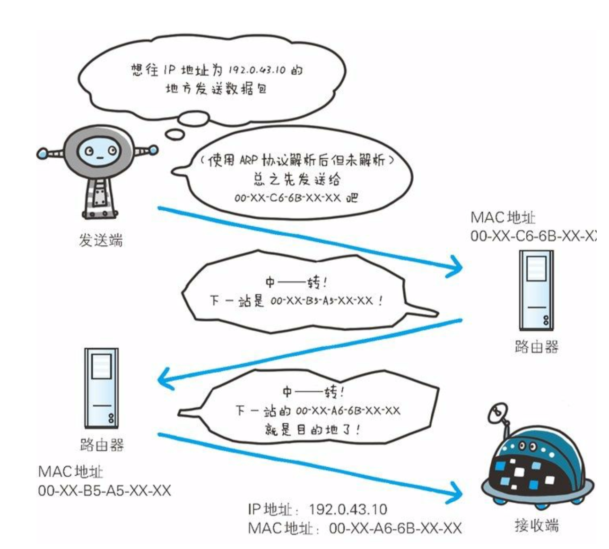
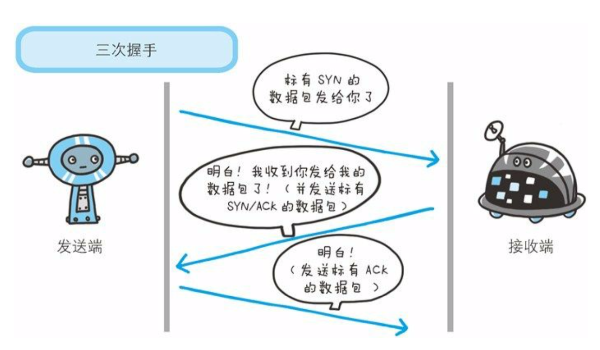
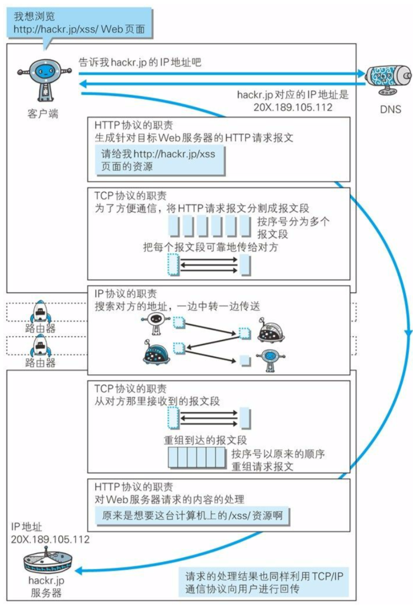
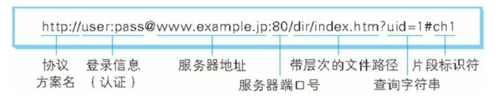

# 1 了解 Web 及网络基础

## 1.3 网络基础TCP/IP

把与互联网相关联的协议集合起来总称为TCP/IP。也有说法认为，TCP/IP是指TCP/IP两种协议。还有说法认为，TCP/IP是在IP协议的通信过程中，使用到的协议族的统称。

### TCP/IP的分层管理

TCP/IP 协议族按层次分别分为以下 4 层：应用层、传输层、网络层和数据链路层。

#### 应用层

TCP/IP 协议族内预存了各类通用的**应用服务**。比如，FTP（FileTransfer Protocol，文件传输协议）和 DNS（Domain Name System，域名系统）服务就是其中两类。HTTP 协议也处于该层。

#### 传输层

传输层对上层应用层，提供处于网络连接中的两台计算机之间的数据传输。在传输层有两个性质不同的协议：**TCP**（Transmission ControlProtocol，传输控制协议）和 **UDP**（User Data Protocol，用户数据报协议）。

#### 网络层

网络层用来处理在**网络上流动的数据包**。数据包是网络传输的最小数据单位。该层规定了通过怎样的路径（所谓的传输路线）到达对方计算机，并把数据包传送给对方。与对方计算机之间通过多台计算机或网络设备进行传输时，网络层所起的作用就是在众多的选项内选择一条传输路线。

#### 链路层

用来处理连接网络的**硬件部分**。包括控制操作系统、硬件的设备驱动、NIC（Network Interface Card，网络适配器，即网卡），及光纤等物理可见部分（还包括连接器等一切传输媒介）。硬件上的范畴均在链路层的作用范围之内。

### TCP/IP通信传输流

利用 TCP/IP 协议族进行网络通信时，会通过分层顺序与对方进行通信。发送端从应用层往下走，接收端则往应用层往上走。我们用 HTTP 举例来说明，

首先作为发送端的客户端在**应用层（HTTP 协议）**发出一个想看某个 Web 页面的 HTTP 请求。

接着，为了传输方便，在**传输层（TCP 协议）**把从应用层处收到的数据（HTTP 请求报文）进行分割，并在各个报文上打上标记序号及端口号后转发给网络层。

在**网络层（IP 协议）**，增加作为通信目的地的 MAC 地址后转发给**链路层**。这样一来，发往网络的通信请求就准备齐全了。

接收端的服务器在链路层接收到数据，按序往上层发送，一直到应用层。当传输到应用层，才能算真正接收到由客户端发送过来的 HTTP请求。

## 1.4 与 HTTP 关系密切的协议  : IP、TCP 和DNS

### 负责传输的IP协议

按层次分，IP（Internet Protocol）网际协议位于网络层。因为几乎所有使用网络的系统都会用到 IP 协议，所以TCP/IP 协议族中的 IP 指的就是网际协议。不要把“IP”和“IP 地址”搞混，“IP”其实是一种协议的名称。

IP 协议的作用是把各种数据包传送给对方。而要保证确实传送到对方
那里，则需要满足各类条件。其中两个重要的条件是 IP 地址和 **MAC地址**（Media Access Control Address）。IP 地址指明了节点被分配到的地址，MAC 地址是指网卡所属的固定地址。IP 地址可以和 MAC 地址进行配对。IP 地址可变换，但 MAC地址基本上不会更改。

IP 间的通信依赖 MAC 地址。在网络上，通常是经过多台计算机和网络设备中转
才能连接到对方。而在进行中转时，会利用下一站中转设备的 MAC
地址来搜索下一个中转目标。这时，会采用 **ARP 协议**（Address
Resolution Protocol）。ARP 是一种用以解析地址的协议，根据通信方
的 IP 地址就可以反查出对应的 MAC 地址。

### 确保可靠性的TCP协议

按层次分，TCP 位于传输层，提供可靠的字节流服务。TCP 协议为了更容易传送大数据才把数据分割，而且 TCP 协议能够确认数据最终是否送达到对方。

为了准确无误地将数据送达目标处，TCP 协议采用了**三次握手**（three-way handshaking）策略。握手过程中使用了 TCP 的标志（flag） —— SYN（synchronize）和ACK（acknowledgement）。

1. 发送端首先发送一个带 SYN 标志的数据包给对方。

2. 接收端收到后，回传一个带有 SYN/ACK 标志的数据包以示传达确认信息。

3. 最后，发送端再回传一个带 ACK 标志的数据包，代表“握手”结束。若在握手过程中某个阶段莫名中断，TCP 协议会再次以相同的顺序发

## 1.5 负责域名解析的  DNS 服务

DNS（Domain Name System）服务是和 HTTP 协议一样位于应用层的协议。它提供域名到 IP 地址之间的解析服务。DNS 协议提供通过域名查找 IP 地址，或逆向从 IP 地址反查域名的服务。

## 1.6 各种协议与  HTTP 协议的关系

我们再通过这张图来了解下 IP 协议、TCP 协议和 DNS 服务在使用HTTP 协议的通信过程中各自发挥了哪些作用。

## 1.7 URI 和 URL

与 URI（Uniform Resource Identifier, 统一资源标识符）相比，我们更熟悉 URL（UniformResource Locator，统一资源定位符）。URL 正是使用 Web 浏览器等访问 Web 页面时需要输入的网页地址。

### URI统一资源标识符

URI 就是由**某个协议方案**表示的资源的定位标识符。协议方案是指访问资源所使用的**协议类型名称**。采用 HTTP 协议时，协议方案就是 http。除此之外，还有 ftp、mailto、telnet、file 等。标准的 URI 协议方案有 30 种左右。

URI 用字符串标识某一互联网资源，而 URL 表示资源的地点（互联网上所处的位置）。可见 URL 是 URI 的子集。

### URI格式

# 2 简单的 HTTP 协议

## 2.3　HTTP 是不保存状态（无状态）的协议

HTTP/1.1 虽然是无状态协议，但为了实现期望的保持状态功能，于是引入了 Cookie 技术。有了 Cookie 再用 HTTP 协议通信，就可以管理状态了。

## 2.5　告知服务器意图的  HTTP 方法

**GET ：获取资源**

GET 方法用来请求访问已被 URI 识别的资源。指定的资源经服务器端解析后返回响应内容。

**POST：传输实体主体**

虽然用 GET 方法也可以传输实体的主体，但一般不用 GET 方法进行传输，而是用 POST 方法。虽说 POST 的功能与 GET 很相似，但POST 的主要目的并不是获取响应的主体内容。

**PUT：传输文件**

PUT 方法用来传输文件。就像 FTP 协议的文件上传一样，要求在请求报文的主体中包含文件内容，然后保存到请求 URI 指定的位置。

但是，鉴于 HTTP/1.1 的 PUT 方法自身不带验证机制，任何人都可以上传文件 , 存在安全性问题，因此一般的 Web 网站不使用该方法。若配合 Web 应用程序的验证机制，或架构设计采用
REST（REpresentational State Transfer，表征状态转移）标准的同类Web 网站，就可能会开放使用 PUT 方法。

**DELETE：删除文件**

DELETE 方法用来删除文件，是与 PUT 相反的方法。DELETE 方法按请求 URI 删除指定的资源。

但是，HTTP/1.1 的 DELETE 方法本身和 PUT 方法一样不带验证机制，所以一般的 Web 网站也不使用 DELETE 方法。当配合 Web 应用程序的验证机制，或遵守 REST 标准时还是有可能会开放使用的。

**HEAD：获得报文首部**

HEAD 方法和 GET 方法一样，只是不返回报文主体部分。用于确认URI 的有效性及资源更新的日期时间等。

**TRACE：追踪路径**

TRACE 方法是让 Web 服务器端将之前的请求通信环回给客户端的方法。发送请求时，在 Max-Forwards 首部字段中填入数值，每经过一个服务器端就将该数字减 1，当数值刚好减到 0 时，就停止继续传输，最后接收到请求的服务器端则返回状态码 200 OK 的响应。

客户端通过 TRACE 方法可以查询发送出去的请求是怎样被加工修改/ 篡改的。这是因为，请求想要连接到源目标服务器可能会通过代理中转，TRACE 方法就是用来确认连接过程中发生的一系列操作。但是，TRACE 方法本来就不怎么常用，再加上它容易引发XST（Cross-Site Tracing，跨站追踪）攻击，通常就更不会用到了。

**CONNECT：要求用隧道协议连接代理**

CONNECT 方法要求在与代理服务器通信时建立隧道，实现用隧道协议进行 TCP 通信。主要使用 SSL（Secure Sockets Layer，安全套接层）和 TLS（Transport Layer Security，传输层安全）协议把通信内容加密后经网络隧道传输。

下表列出了 HTTP/1.0 和 HTTP/1.1 支持的方法。另外，方法名区分大小写，注意要用大写字母。

| 方法    | 说明                   | 支持的HTTP协议版本 |
| ------- | ---------------------- | ------------------ |
| GET     | 获取资源               | 1.0、1.1           |
| POST    | 传输实体主体           | 1.0、1.1           |
| PUT     | 传输文件               | 1.0、1.1           |
| HEAD    | 获得报文首部           | 1.0、1.1           |
| DELETE  | 删除文件               | 1.0、1.1           |
| OPTIONS | 询问支持的方法         | 1.1                |
| TRACE   | 追踪路径               | 1.1                |
| CONNECT | 要求用隧道协议连接代理 | 1.1                |
| LINK    | 建立和资源之间的联系   | 1.0                |
| UNLINK  | 断开🔗关系              | 1.0                |

## 2.7　持久连接节省通信量

HTTP 协议的初始版本中，每进行一次 HTTP 通信就要断开一次 TCP连接。

以当年的通信情况来说，因为都是些容量很小的文本传输，所以即使这样也没有多大问题。可随着 HTTP 的普及，文档中包含大量图片的情况多了起来。因此，每次的请求都会造成无谓的 TCP 连接建立和断开，增加通信量的开销。

### 持久连接

为解决上述 TCP 连接的问题，HTTP/1.1 和一部分的 HTTP/1.0 想出了持久连接（HTTP Persistent Connections，也称为 HTTP keep-alive 或HTTP connection reuse）的方法。持久连接的特点是，只要任意一端没有明确提出断开连接，则保持 TCP 连接状态。

图：持久连接旨在建立   1 次 TCP 连接后进行多次请求和响应的交互

持久连接的好处在于减少了 TCP 连接的重复建立和断开所造成的额外开销，减轻了服务器端的负载。

在 HTTP/1.1 中，所有的连接默认都是持久连接，但在 HTTP/1.0 内并未标准化。除了服务器端，客
户端也需要支持持久连接。

### 管线化

持久连接使得多数请求以管线化（pipelining）方式发送成为可能。从前发送请求后需等待并收到响应，才能发送下一个请求。管线化技术出现后，不用等待响应亦可直接发送下一个请求。这样就能够做到同时并行发送多个请求，而不需要一个接一个地等待响应了。

比如，当请求一个包含 10 张图片的 HTML Web 页面，与挨个连接相比，用持久连接可以让请求更快结束。而管线化技术则比持久连接还要快。请求数越多，时间差就越明显。

## 2.8　使用 Cookie 的状态管理

HTTP 是无状态协议，它不对之前发生过的请求和响应的状态进行管理。也就是说，无法根据之前的状态进行本次的请求处理。

不可否认，无状态协议当然也有它的优点。由于不必保存状态，自然可减少服务器的 CPU 及内存资源的消耗。从另一侧面来说，也正是因为 HTTP 协议本身是非常简单的，所以才会被应用在各种场景里。

为了保留无状态协议这个特征的同时又要解决类似的矛盾问题，于是引入了 Cookie 技术。

Cookie 技术通过在请求和响应报文中写入 Cookie 信息来控制客户端的状态。

Cookie 会根据从服务器端发送的响应报文内的一个叫做 Set-Cookie 的首部字段信息，通知客户端保存 Cookie。当下次客户端再往该服务器发送请求时，客户端会自动在请求报文中加入 Cookie 值后发送出
去。服务器端发现客户端发送过来的 Cookie 后，会去检查究竟是从哪一个客户端发来的连接请求，然后对比服务器上的记录，最后得到之前的状态信息。

1. 请求报文（没有Cookie 信息的状态）

   GET /reader/ HTTP/1.1
   Host: hackr.jp
   *首部字段内没有Cookie的相关信息响应报文（服务器端生成    Cookie 信息）

2. 响应报文（服务器端生成  Cookie 信息）

   HTTP/1.1 200 OK
   Date: Thu, 12 Jul 2012 07:12:20 GMT
   Server: Apache
   **＜Set-Cookie: sid=1342077140226724; path=/; expires=Wed,10-Oct-12 07:12:20 GMT＞**
   Content-Type: text/plain; charset=UTF-8

3. 请求报文（自动发送保存着的Cookie 信息）

   GET /image/ HTTP/1.1
   Host: hackr.jp
   **Cookie: sid=1342077140226724**

   
## 4.1　返回结果的HTTP状态码

**状态码的类别**

|      | 类别                             | 原因短语                   |
| :--- | -------------------------------- | -------------------------- |
| 1XX  | Informational（信息性状态码）    | 接收的请求正在处理         |
| 2XX  | Success（成功状态码）            | 请求正常处理完毕           |
| 3XX  | Redirection（重定向状态码）      | 需要进行附加操作以完成请求 |
| 4XX  | Client Error（客户端错误状态码） | 服务器无法处理请求         |
| 5XX  | Server Error（服务器错误状态码） | 服务器处理请求出错         |

# 7 确保 Web 安全的HTTPS

## 7.1　HTTP 的缺点

HTTP 主要有这些不足，例举如下。
1. 通信使用明文（不加密），内容可能会被窃听
2. 不验证通信方的身份，因此有可能遭遇伪装
3. 无法证明报文的完整性，所以有可能已遭篡改

## 7.2　HTTP+ 加密 + 认证 + 完整性保护=HTTPS

HTTPS 并非是应用层的一种新协议。只是 HTTP **通信接口部分**用SSL（Secure Socket Layer）和 TLS（Transport Layer Security）协议代替而已。

通常，HTTP 直接和 TCP 通信。当使用 SSL 时，则演变成先和 SSL 通信，再由 SSL 和 TCP 通信了。简言之，所谓 HTTPS，其实就是身披SSL 协议这层外壳的 HTTP。

SSL 是独立于 HTTP 的协议，所以不光是 HTTP 协议，其他运行在应用层的 SMTP 和 Telnet 等协议均可配合 SSL 协议使用。可以说 SSL 是当今世界上应用最为广泛的网络安全技术。

### HTTPS的安全通信机制

步骤 1：客户端通过发送 Client Hello 报文开始 SSL 通信。报文中包含客户端支持的 SSL 的指定版本、加密组件（Cipher Suite）列表（所使用的加密算法及密钥长度等）。

步骤 2：服务器可进行 SSL 通信时，会以 Server Hello 报文作为应答。和客户端一样，在报文中包含 SSL 版本以及加密组件。服务器的加密组件内容是从接收到的客户端加密组件内筛选出来的。

步骤 3：之后服务器发送 Certificate 报文。报文中包含公开密钥证书。

步骤 4：最后服务器发送 Server Hello Done 报文通知客户端，最初阶段的 SSL 握手协商部分结束。

步骤 5： SSL 第一次握手结束之后，客户端以 Client Key Exchange 报文作为回应。报文中包含通信加密中使用的一种被称为 Pre-master secret 的随机密码串。该报文已用步骤 3 中的公开密钥进行加密。

步骤 6：接着客户端继续发送 Change Cipher Spec 报文。该报文会提示服务器，在此报文之后的通信会采用 Pre-master secret 密钥加密。

步骤 7：客户端发送 Finished 报文。该报文包含连接至今全部报文的整体校验值。这次握手协商是否能够成功，要以服务器是否能够正确解密该报文作为判定标准。

步骤 8：服务器同样发送 Change Cipher Spec 报文。

步骤 9：服务器同样发送 Finished 报文。

步骤 10：服务器和客户端的 Finished 报文交换完毕之后，SSL 连接就算建立完成。当然，通信会受到 SSL 的保护。从此处开始进行应用层协议的通信，即发送 HTTP 请求。

步骤 11：应用层协议通信，即发送 HTTP 响应。

步骤 12：最后由客户端断开连接。断开连接时，发送 close_notify 报文。上图做了一些省略，这步之后再发送 TCP FIN 报文来关闭与 TCP的通信。

下面是对整个流程的图解。图中说明了从仅使用服务器端的公开密钥证书（服务器证书）建立 HTTPS 通信的整个过程。

**SSL 和 TLS**

HTTPS 使用 SSL（Secure Socket Layer）和 TLS（Transport LayerSecurity）这两个协议。

SSL 技术最初是由浏览器开发商网景通信公司率先倡导的，开发过 SSL3.0 之前的版本。TSL 是以 SSL 为原型开发的协议，有时会统一称该协议为 SSL。当前主流的版本是 SSL3.0 和 TLS1.0。

**SSL 速度很慢**

SSL 的慢分两种。和使用 HTTP 相比，还必须进行 SSL 通信，网络负载可能会变慢 2 到 100 倍。另一点是 SSL 必须在服务器和客户端都需要进行加密和解密的运算处理。比起 HTTP 会更多地消耗服务器和客户端的硬件资源，导致负载增强。

# 8 确认访问用户身份的认证

核对的信息通常是指以下这些：

- 密码：只有本人才会知道的字符串信息。
- 动态令牌：仅限本人持有的设备内显示的一次性密码。
- 数字证书：仅限本人（终端）持有的信息。
- 生物认证：指纹和虹膜等本人的生理信息。
- IC 卡等：仅限本人持有的信息。

HTTP/1.1 使用的认证方式如下所示。

- BASIC 认证（基本认证）
- DIGEST 认证（摘要认证）
- SSL 客户端认证
- FormBase 认证（基于表单认证）

# 9 基于 HTTP 的功能追加协议

若想在现有 Web 实现所需的功能，以下这些 HTTP 标准就会成为瓶颈。

- 一条连接上只可发送一个请求。
- 请求只能从客户端开始。客户端不可以接收除响应以外的指令。
- 请求 / 响应首部未经压缩就发送。首部信息越多延迟越大。
- 发送冗长的首部。每次互相发送相同的首部造成的浪费较多。
- 可任意选择数据压缩格式。非强制压缩发送。

**Ajax**（Asynchronous JavaScript and XML，异步 JavaScript 与 XML 技术）是一种有效利用 JavaScript 和 DOM（Document Object Model，文档对象模型）的操作，以达到局部 Web 页面替换加载的异步通信手段。和以前的同步通信相比，由于它只更新一部分页面，响应中传输的数据量会因此而减少，这一优点显而易见。

**Comet** 。服务器端接收到请求，在处理完毕后就会立即返回响应，但为了实现推送功能，Comet 会先将响应置于挂起状态，当服务器端有内容更新时，再返回该响应。因此，服务器端一旦有更新，就可以立即反馈给客户端。

**SPDY**。SPDY 没有完全改写 HTTP 协议，而是在 TCP/IP 的应用层HTTP与运输层TCP之间通过新加会话层的形式运作。同时，考虑到安全性问题，SPDY 规定通信中使用 SSL。

## 9.3　使用浏览器进行全双工通信的WebSocket

一旦 Web 服务器与客户端之间建立起 WebSocket 协议的通信连接，之后所有的通信都依靠这个专用协议进行。通信过程中可互相发送JSON、XML、HTML 或图片等任意格式的数据。

由于是建立在 HTTP 基础上的协议，因此连接的发起方仍是客户端，而一旦确立 WebSocket 通信连接，不论服务器还是客户端，任意一方都可直接向对方发送报文。

 **WebSocket 协议的主要特点。**

- 推送功能
- 减少通信量