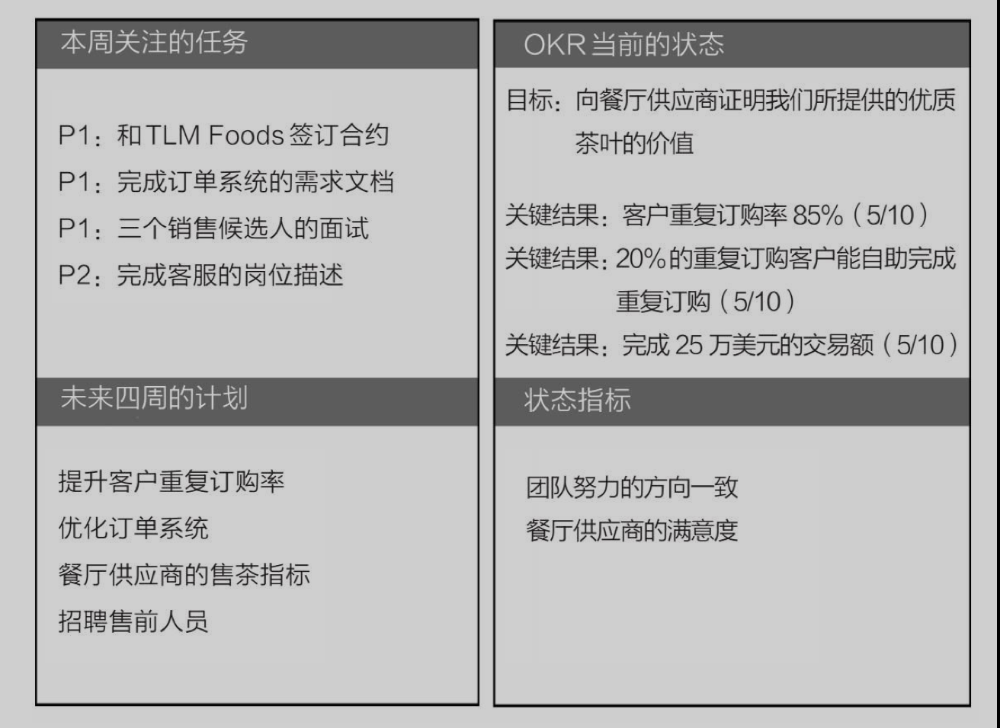

# OKR工作法

## 第一章 确定目标，确保团队聚焦到重要目标上

##### 英特尔内部遇到不好做的决策，都会用‘换个首席执行官’的思路去想办法。可见，没有过往经历和个人情绪的影响，可能更容易做出正确的决定。

### OKR的定义

OKR的O是指目标，英文是objective；KR是指关键结果，英文是keyresults。公司用这一方法来确保团队聚焦到重要的目标上。每个季度团队可以设置一个有挑战的、方向明确的目标，同时设置三四个明确且具体的结果指标，并且这些指标能确保目标的完成。

OKR需要设置有挑战的目标，我们要那种有一半的把握能达到的目标，然后带领团队尽最大的努力实现它

## 第二章 讨论关键结果，复盘OKR实施过程中的问题

“OKR是用来推进事情的，我们先集中精力聚焦到一件事情上，才不至于浅尝辄止。这些状态指标也很重要，我们持续关注就行，如果所有事情都一样重要那就没有意义了。

### 矩形的右上方列出目标和关键结果，后面再标出信心指数。我们拿上个季度的价值目标为例。

目标：向餐厅供应商证明我们所提供的优质茶叶的价值。

关键结果1：客户重复订购率达到85%。（5/10）

关键结果2：20%的重复订购客户能自助完成重复订购。（5/10）

关键结果3：完成25万美元的交易额。（5/10）

### 在矩形的左上方，列出为了完成本周目标要做的最重要的几件事，最多4件，顺便标上优先级，P1是必须做的，P2是应该做的，不需要做的不列。

P1：和TLMFoods公司签订合约。

P1：完成订单系统的需求文档。

P1：三个销售候选人的面试。

P2：完成客服的岗位描述。

### 在左下方列出我们后续计划要做的重要工作，一般是后四周的目标。这个模块是为了保证我们都在同一个频道上，方便后续的跨部门协作

### 右下角我们的状态指标。会遇到很多挑战和问题，所以要确保所有人一直有良好的状态，不要精疲力竭或者哪个环节掉链子

#### 团队一起努力才有意义，所以我们要一起制定目标，一起帮团队找出关键结果，这才是真正的OKR。这是我们大家的公司，我们共进退！

## 第四章 影响目标达成的关键因素

#### 无法达成目标的5个关键因素

1. 没有给目标设置优先级
2. 缺乏充分沟通，导致没能准确理解目标

3. 没有做好计划
4. 没有把时间花在重要的事情上
5. 轻易放弃

### 在实施OKR前，先明确企业的使命

我们通过（什么样的价值主张）在（什么领域或行业）（改善人们的生活或减少人们的痛苦）

### OKR设定目标要遵循3个原则

1. 原则1：目标要明确方向并且鼓舞人心
2. 原则2：目标要有时间期限
3. 原则3：由独立的团队来执行目标

## 第五章 OKR使用的六大场景

### OKR会议的7个步骤

1.所有员工提交他们认为这个季度公司需要实现的目标。这能让这套方法顺利地执行下去，员工能直接参与公司目标的制定，会给企业文化注入一些有趣的东西。如果公司上规模了，可以让首席执行官发动团队，或者通过专业顾问和调研机构收集整理，最后把结果给到管理层就可以了。

2.管理层用半天的时间讨论OKR。选择一个目标，需要通过争论、妥协的过程，这个过程值得多花些时间。然后继续给目标设置关键结果，作为目标更精确的补充说明。我经历过的OKR会议最少也要开一个半小时。OKR会议开的时间长有很多原因，除了必要的讨论步骤，会议延时、参会人员没有提前做充分的思考、回避做决定，这些问题人力资源部门都可以提前处理好。要知道，公司的目标就是公司的命脉，所有人都要承担责任。

3.管理层作业：向各自主管的部门介绍公司季度OKR，并完成每个部门的OKR设置。部门经理和成员通过两个小时左右的会议，通过自由列举目标、归类分组关键结果、投票排序，做出最后的选择。

4.首席执行官确认部门OKR。部门OKR设置完成后，首席执行官再确认一次，如果发现有的部门对公司OKR的理解有偏差，再通过一个一小时的会议继续和这个部门讨论。准备好一天的时间去做这件事。

5.自上而下关联。部门经理在把公司和部门的OKR传达给下级子部门时，再用同样的方法制定各自的OKR。

6.个人OKR（可选）。如果公司要求个人也要设置OKR，那就立即去做。个人OKR需要经理确认。这是一次绝好的指导机会，可以采用一对一的沟通方式，千万不要用邮件完成。

7.全体会议。首席执行官向全员解释这个季度的OKR是什么，为什么是这样设置的，然后对其中几个进行示范性的任务拆解。解释的时候也要涵盖上个季度的OKR总结，指出上个季度的成果。整个会议要创造积极的气氛，并且让员工明白会议后就要立即付诸行动了。

### 避开OKR常见的坑

- 设置了多个目标
- 设置的OKR周期过短——一周或者一个月
- 用绩效指标来驱动目标的完成
- 没有设置信心指数
- 没有追踪信息指数的变化
- 把周一的会议当作汇报例会，而不是谈话
- 周五过于严肃

